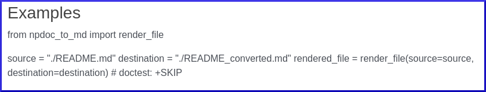
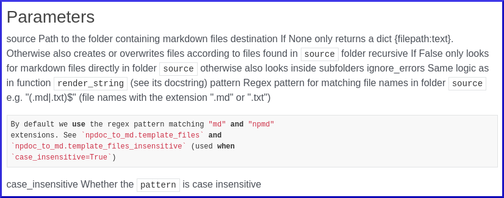

Here I am trying out the library [mkdocstrings](https://github.com/mkdocstrings/mkdocstrings). Follow the instructions below to test the results.

# Installation

First, install the library, preferably in the conda environment at the root of the repo, and then:

```
pip install mkdocstrings[crystal,python]
pip install Pygments==2.12
```

# Usage

```
mkdocs serve
```

# Problems

mkdocstrings seems to have a few problems with numpydoc style docstrings (see below). You are supposed to use Google style docstrings.

1. The examples in docstrings are not rendered as code



2. Parameters are hard to read. For instance there is no distinction and no spacing with parameter names (see screenshot below e.g. parameter "source")
3. Sometimes the text is wrongfully interpreted as code (see screenshot below)


